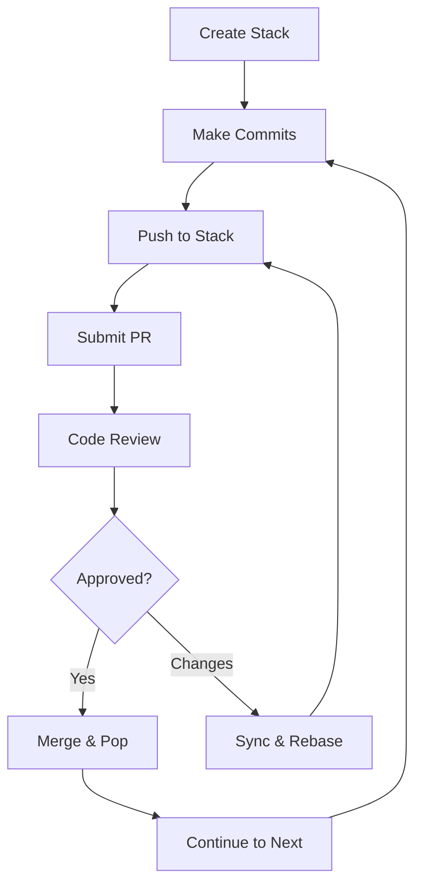

# 📚 Cascade CLI - Git Stack Management for Teams

> **Professional Git workflow management with stacked diffs and seamless Bitbucket integration**

[](https://rustup.rs/)
[](./PRODUCTION_CHECKLIST.md)
[](#testing)

Cascade CLI revolutionizes Git workflows by enabling **stacked diffs** - a powerful technique for managing chains of related commits as separate, reviewable pull requests. Perfect for feature development, bug fixes, and complex changes that benefit from incremental review.

## ✨ **Key Features**

### 🔄 **Stacked Diff Workflow**
- **Chain related commits** into logical, reviewable stacks
- **Independent PR reviews** while maintaining dependencies  
- **Automatic rebase management** when dependencies change
- **Zero force-push strategy** for safe collaboration

### 🏢 **Enterprise Integration**
- **Bitbucket Server/Cloud** native integration
- **Pull request automation** with dependency tracking
- **Team workflow enforcement** via Git hooks
- **Progress tracking** with real-time status updates

### 🖥️ **Professional Interface**
- **Interactive TUI** for visual stack management
- **Shell completions** (bash, zsh, fish)
- **Rich visualizations** (ASCII, Mermaid, Graphviz, PlantUML)
- **Beautiful CLI** with progress bars and colored output

---

## 🚀 **Quick Start**

### **1. Installation**

#### **From Source (Recommended)**
```bash
# Clone and build
git clone https://github.com/JAManfredi/cascade-cli.git
cd cascade-cli
cargo build --release

# Add to PATH
export PATH="$PWD/target/release:$PATH"
```

#### **Pre-built Binaries** *(Coming Soon)*
```bash
# macOS/Linux
curl -L https://github.com/JAManfredi/cascade-cli/releases/latest/download/cc | sh

# Windows
# Download from GitHub releases
```

### **2. Initialize Your Repository**
```bash
# Navigate to your Git repository
cd my-project

# Quick setup wizard (recommended)
cc setup

# Or manual initialization
cc init --bitbucket-url https://bitbucket.company.com
```

### **3. Create Your First Stack**
```bash
# Create a new stack
cc stack create feature-auth --base develop --description "User authentication system"

# Make some commits
git add . && git commit -m "Add login endpoint"
git add . && git commit -m "Add password validation"

# Push commits to stack
cc stack push
cc stack push

# Submit for review
cc stack submit
```

### **4. Experience the Magic**
```bash
# Interactive stack browser
cc tui

# Visualize your stacks
cc viz deps --format mermaid

# Auto-install Git hooks
cc hooks install
```

---

## 🎯 **Core Workflow**

### **The Stack Lifecycle**



### **1. Stack Creation**
```bash
# Create a logical grouping for related changes
cc stack create feature-name --base main
cc stack create fix-bug-123 --base develop
```

### **2. Commit Management**
```bash
# Add commits to your active stack
git commit -m "Implement core feature"
cc stack push

git commit -m "Add comprehensive tests"  
cc stack push
```

### **3. Pull Request Submission**
```bash
# Submit individual commits as separate PRs
cc stack submit      # Submit top commit
cc stack submit 1    # Submit specific stack entry
```

### **4. Dependency Management**
```bash
# When base changes, sync your stack
cc stack sync

# Rebase stack entries safely
cc stack rebase --strategy cherry-pick
```

---

## 📖 **Command Reference**

### **Stack Management**
```bash
cc stack create <name>           # Create new stack
cc stack list                    # Show all stacks  
cc stack switch <name>           # Activate stack
cc stack push                    # Add current commit to stack
cc stack pop                     # Remove top entry from stack
cc stack show                    # Display stack details
cc stack delete <name>           # Remove stack
```

### **Pull Request Workflow** 
```bash
cc stack submit [entry]          # Create PR for entry
cc stack status                  # Show PR status
cc stack prs                     # List all PRs
cc stack sync                    # Sync with remote changes
cc stack rebase                  # Rebase stack on latest base
```

### **Advanced Tools**
```bash
cc tui                           # Launch interactive TUI
cc viz stack                     # ASCII stack diagram
cc viz deps --format mermaid     # Dependency graph
cc hooks install                 # Install Git hooks
cc setup                         # Interactive configuration
```

---

## 🔧 **Configuration**

### **Bitbucket Setup**
```bash
# Interactive wizard (recommended)
cc setup

# Manual configuration
cc config set bitbucket.url "https://bitbucket.company.com"
cc config set bitbucket.project "PROJECT"
cc config set bitbucket.repository "repo-name"
cc config set bitbucket.token "your-personal-access-token"
```

### **Git Hooks (Optional)**
```bash
# Install all hooks for automated workflow
cc hooks install

# Check status
cc hooks status

# Individual hook management
cc hooks add post-commit
cc hooks remove pre-push
```

---

## 🎨 **Advanced Features**

### **Terminal User Interface**
Launch `cc tui` for an interactive stack browser with:
- Real-time stack visualization
- Keyboard navigation (↑/↓/Enter/q)
- Live status updates
- Error handling and recovery

### **Visualization Export**
```bash
# Generate diagrams for documentation
cc viz stack --format mermaid --output docs/stack.md
cc viz deps --format dot --output diagrams/deps.dot

# Include in CI/CD pipeline
cc viz deps --format plantuml | plantuml -pipe > architecture.png
```

### **Shell Integration**
```bash
# Install completions
cc completions install

# Check installation
cc completions status

# Manual installation
cc completions generate bash > /etc/bash_completion.d/cc
```

---

## 🏗️ **Architecture**

Cascade CLI is built with:
- **🦀 Rust** - Performance, safety, and reliability
- **📚 git2** - Native Git operations without subprocess overhead
- **🌐 HTTP/REST** - Direct Bitbucket API integration  
- **🎨 TUI Libraries** - Rich terminal interfaces (ratatui, crossterm)
- **⚡ Async** - Non-blocking operations with tokio

### **Design Principles**
- **Zero Force Push** - Safe for team collaboration
- **Atomic Operations** - All-or-nothing state changes
- **Conflict Detection** - Early detection with resolution guidance
- **Graceful Degradation** - Continue working when services are unavailable

---

## 🧪 **Testing**

```bash
# Run full test suite
cargo test -- --test-threads=1

# Tests cover:
# - Core stack management (40 tests)
# - Git operations and safety
# - Bitbucket integration  
# - CLI command functionality
# - Error handling and recovery
```

**Test Coverage**: 40/40 tests passing ✅

---

## 🤝 **Contributing**

We welcome contributions! See our [Contributing Guide](./docs/CONTRIBUTING.md) for details.

### **Development Setup**
```bash
git clone https://github.com/JAManfredi/cascade-cli.git
cd cascade-cli
cargo build
cargo test
```

### **Release Process**
See [Release Guide](./docs/RELEASING.md) for maintainer instructions.

---

## 📝 **Documentation**

- 📚 **[User Manual](./docs/USER_MANUAL.md)** - Complete command reference
- 🚀 **[Installation Guide](./docs/INSTALLATION.md)** - Platform-specific instructions
- 🎓 **[Onboarding Guide](./docs/ONBOARDING.md)** - Step-by-step tutorial
- 🔧 **[Configuration Reference](./docs/CONFIGURATION.md)** - All settings explained
- 🐛 **[Troubleshooting](./docs/TROUBLESHOOTING.md)** - Common issues and solutions
- 🏗️ **[Architecture](./docs/ARCHITECTURE.md)** - Internal design and extending

---

## 📜 **License**

This project is licensed under the MIT License - see the [LICENSE](LICENSE) file for details.

---

## 🌟 **Why Stacked Diffs?**

Traditional Git workflows often result in:
- **Large, hard-to-review PRs** 
- **Blocked development** waiting for reviews
- **Merge conflicts** from long-lived branches
- **Lost context** in massive changesets

**Stacked diffs solve this by:**
- ✅ **Small, focused PRs** that are easy to review
- ✅ **Parallel development** with dependency management  
- ✅ **Reduced conflicts** through frequent integration
- ✅ **Better code quality** via incremental feedback

---

<p align="center">
  <strong>📚 Transform your Git workflow with Cascade CLI</strong><br>
  <em>Professional stack management for modern development teams</em>
</p> 