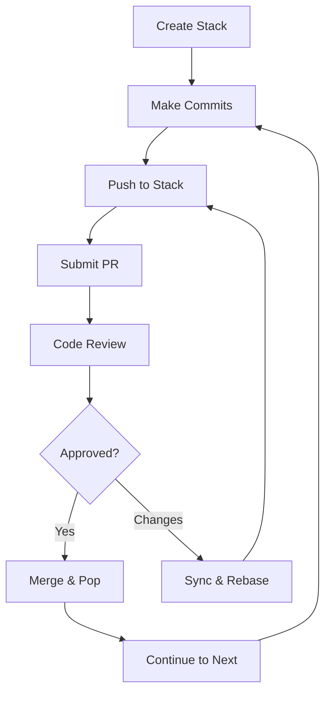

# 📚 Cascade CLI - Git Stack Management for Teams

> **Professional Git workflow management with stacked diffs and seamless Bitbucket integration**

[](https://rustup.rs/)
[](https://github.com/JAManfredi/cascade-cli/actions/workflows/ci.yml)
[](./PRODUCTION_CHECKLIST.md)
[](#testing)

Cascade CLI revolutionizes Git workflows by enabling **stacked diffs** - a powerful technique for managing chains of related commits as separate, reviewable pull requests. Perfect for feature development, bug fixes, and complex changes that benefit from incremental review.

## ✨ **Key Features**

### 🔄 **Stacked Diff Workflow**
- **Chain related commits** into logical, reviewable stacks
- **Independent PR reviews** while maintaining dependencies  
- **Automatic rebase management** when dependencies change
- **Smart force-push strategy** to preserve review history
- **Smart conflict resolution** - Auto-resolves 60-80% of common rebase conflicts

### 🏢 **Enterprise Integration**
- **Bitbucket Server/Cloud** native integration
- **Pull request automation** with dependency tracking
- **Team workflow enforcement** via Git hooks
- **Progress tracking** with real-time status updates

### 🖥️ **Professional Interface**
- **Interactive TUI** for visual stack management
- **Shell completions** (bash, zsh, fish)
- **Rich visualizations** (ASCII, Mermaid, Graphviz, PlantUML)
- **Beautiful CLI** with progress bars and colored output

---

## 🌿 **How Stacked Diffs Work: Branch Management**

### **Key Insight: Each Commit = Its Own Branch + PR**

Cascade CLI **automatically creates individual branches** for each commit in your stack:

```bash
# You work normally (on main or a feature branch)
git checkout main  # or: git checkout -b my-feature-branch
cc stack create feature-auth --base main

# Make commits as usual
git commit -m "Add user authentication endpoints"
git commit -m "Add password validation logic"  
git commit -m "Add comprehensive auth tests"

# Push to stack - Cascade CLI creates separate branches automatically:
cc stack push  # → Creates: add-user-authentication-endpoints
cc stack push  # → Creates: add-password-validation-logic  
cc stack push  # → Creates: add-comprehensive-auth-tests

# Submit creates individual PRs to main:
cc stack submit  # PR #101: add-user-authentication-endpoints → main
cc stack submit  # PR #102: add-password-validation-logic → main (depends on #101)
cc stack submit  # PR #103: add-comprehensive-auth-tests → main (depends on #102)
```

### **Two Workflow Options:**

#### **Option 1: Work on Main (Recommended for Solo Development)**
```bash
git checkout main
cc stack create feature-name --base main
# Make commits directly on main (they stay local until you push to remote)
# Cascade CLI handles all branch creation and PR management
```

#### **Option 2: Work on Feature Branch (Team-Friendly)**  
```bash
git checkout -b feature-work
cc stack create feature-name --base main
# Make commits on your feature branch
# Cascade CLI creates individual branches from your feature branch
# All PRs target main, not your feature branch
```

### **What You See vs. What Reviewers See:**

| **You (Developer)** | **Reviewers (Bitbucket)** |
|---|---|
| Work on 1 branch | See 3 separate PRs |
| 3 commits in sequence | Each PR focuses on 1 logical change |
| `git log` shows: A→B→C | PR #101: A, PR #102: B, PR #103: C |

### **The Magic: Auto-Generated Branch Names**

Cascade CLI creates meaningful branch names from your commit messages:

```bash
"Add user authentication endpoints"   → add-user-authentication-endpoints
"Fix login timeout bug"              → fix-login-timeout-bug  
"Refactor password validation!!!"    → refactor-password-validation
```

---

## 🚀 **Quick Start**

### **1. Installation**

#### **Quick Install (Recommended)**

**Universal Script (Linux/macOS):**
```bash
curl -fsSL https://raw.githubusercontent.com/JAManfredi/cascade-cli/master/install.sh | bash
```

**Package Managers:**
```bash
# macOS - Homebrew
brew install JAManfredi/cascade-cli/cascade-cli

# Rust users
cargo install cascade-cli
```

#### **Manual Installation**

**Pre-built Binaries:**
```bash
# macOS (auto-detect architecture)
curl -L https://github.com/JAManfredi/cascade-cli/releases/latest/download/cc-macos-$(uname -m | sed 's/x86_64/x64/;s/arm64/arm64/').tar.gz | tar -xz
sudo mv cc /usr/local/bin/

# Linux (auto-detect architecture)  
curl -L https://github.com/JAManfredi/cascade-cli/releases/latest/download/cc-linux-$(uname -m | sed 's/x86_64/x64/;s/aarch64/arm64/').tar.gz | tar -xz
sudo mv cc /usr/local/bin/

# Windows (PowerShell)
Invoke-WebRequest -Uri "https://github.com/JAManfredi/cascade-cli/releases/latest/download/cc-windows-x64.exe.zip" -OutFile "cc.zip"
Expand-Archive -Path "cc.zip" -DestinationPath "$env:USERPROFILE\bin\"
```

**From Source:**
```bash
git clone https://github.com/JAManfredi/cascade-cli.git
cd cascade-cli
cargo build --release
cargo install --path .
```

See [Installation Guide](./docs/INSTALLATION.md) for detailed platform-specific instructions.

### **2. Initialize Your Repository**
```bash
# Navigate to your Git repository
cd my-project

# Quick setup wizard (recommended)
cc setup

# Or manual initialization
cc init --bitbucket-url https://bitbucket.company.com
```

### **3. Create Your First Stack**
```bash
# Create a new stack
cc stack create feature-auth --base develop --description "User authentication system"

# Make multiple incremental commits (for your own tracking)
git add . && git commit -m "WIP: start authentication"
git add . && git commit -m "WIP: add login logic"
git add . && git commit -m "WIP: fix validation bugs"
git add . && git commit -m "Final: complete auth with tests"

# 🎉 NEW: SQUASH + PUSH - Combine incremental commits into clean commit!
cc stack push --squash 4  # Squashes last 4 commits into 1

# OR: Make some commits normally, then squash later ones
git commit -m "Add core authentication logic"
cc stack push  # Push first clean commit

git commit -m "WIP: start tests"
git commit -m "WIP: more tests"  
git commit -m "Final: comprehensive test suite"

# 🎉 SQUASH UNPUSHED - Only squash the last 3 commits
cc stack push --squash 3  # Squashes and pushes as second stack entry

# 🎉 BATCH SUBMIT - Submit all entries as separate PRs!
cc stack submit --all

# Alternative options:
cc stack push --all                             # Push all unpushed commits separately
cc stack push --squash-since HEAD~5             # Squash all commits since HEAD~5
cc stack submit --range 1-3                     # Submit entries 1 through 3
```

### **4. Experience the Magic**
```bash
# Interactive stack browser
cc tui

# Visualize your stacks
cc viz deps --format mermaid

# Auto-install Git hooks
cc hooks install
```

---

## 🤖 **Smart Conflict Resolution**

### **Automatic Conflict Resolution**

Cascade CLI automatically resolves **4 types of common conflicts** during rebases, dramatically reducing manual intervention:

### **✅ Resolved Automatically**

| **Conflict Type** | **Description** | **Example** |
|---|---|---|
| **🎨 Whitespace** | Only formatting differences | Tabs vs spaces, trailing whitespace |
| **🔄 Line Endings** | CRLF vs LF differences | Windows vs Unix line endings |
| **➕ Pure Additions** | Non-overlapping changes | Both sides only add new lines |
| **📦 Import Sorting** | Reordered import statements | Use/import statements in different order |

### **How It Works**

```bash
# When conflicts occur during rebase:
cc stack rebase
# ✅ Auto-resolved whitespace conflict in src/main.rs
# ✅ Auto-resolved import ordering in src/lib.rs  
# ❌ Manual resolution needed in src/auth.rs (complex logic conflict)
# 🎉 Auto-resolved conflicts in 2/3 files

# Only the complex conflict needs your attention!
```

### **Supported File Types for Import Resolution**
- **Rust** - `use` statements and `extern crate`
- **Python** - `import` and `from ... import` statements  
- **JavaScript/TypeScript** - `import`, `const`, and `require()` statements
- **Go** - `import` blocks and statements
- **Java** - `import` statements

### **Benefits**
- **⚡ 60-80% fewer** manual conflict resolutions
- **🚀 Faster rebases** in active development cycles
- **🛡️ Safe and conservative** - only resolves unambiguous conflicts
- **📝 Full logging** of what was auto-resolved vs what needs attention

### **Configuration**
Smart conflict resolution is **enabled by default**. To disable:

```bash
# Disable in specific rebase
cc stack rebase --no-auto-resolve

# Or configure globally  
cc config set cascade.auto_resolve_conflicts false
```

---

## 🎯 **Core Workflow**

### **The Stack Lifecycle**



### **1. Stack Creation**
```bash
# Create a logical grouping for related changes
cc stack create feature-name --base main
cc stack create fix-bug-123 --base develop
```

### **2. Commit Management**
```bash
# Add commits to your active stack
git commit -m "Implement core feature"
cc stack push

git commit -m "Add comprehensive tests"  
cc stack push
```

### **3. Pull Request Submission**
```bash
# Submit individual commits as separate PRs
cc stack submit      # Submit top commit
cc stack submit 1    # Submit specific stack entry
```

### **4. Dependency Management**
```bash
# When base changes, sync your stack
cc stack sync

# Rebase stack entries safely
cc stack rebase --strategy cherry-pick
```

---

## 🔄 **Complex Workflow Examples**

### **Scenario 1: Code Review Feedback on Middle Commit**

You have a 3-commit stack and need to modify the middle commit based on review feedback:

```bash
# Your stack: A -> B -> C (need to modify B)
cc stack show
# Entry 1: [abc123] Add authentication endpoints    (PR #101 - Open)
# Entry 2: [def456] Add password validation        (PR #102 - Changes Requested) ← Need to fix
# Entry 3: [ghi789] Add user registration tests    (PR #103 - Open)

# Checkout the specific commit that needs changes
git checkout def456

# Make your changes based on review feedback
git add .
git commit --amend -m "Add password validation (addressed security review)"

# This creates a new commit hash - rebase the stack to update dependencies
cc stack rebase

# What happens:
🔄 Rebasing stack: authentication
   ✅ Force-pushed new content to existing branches (preserves PR #101, #102, #103)
   ✅ All dependent commits automatically updated
   ✅ Review history preserved on all PRs

# PRs #101, #102, #103 now show updated code but keep all comments/approvals
```

### **Scenario 2: Base Branch Updates (Smart Force Push)**

Main branch gets updated while you're working on a feature stack:

```bash
# Your feature stack is based on old main
cc stack show
# Base: main (behind by 5 commits)
# Entry 1: [abc123] Implement OAuth flow
# Entry 2: [def456] Add OAuth tests

# Main branch has new commits - sync your stack
git checkout main && git pull  # Get latest main

# Rebase your entire stack on updated main
cc stack rebase

# Smart force push preserves all PR history:
🔄 Rebasing stack: oauth-feature
   📋 Branch mapping:
      implement-oauth -> implement-oauth-v2
      oauth-tests -> oauth-tests-v2
   
   🔄 Preserved pull request history:
      ✅ Force-pushed implement-oauth-v2 to implement-oauth (preserves PR #105)
      ✅ Force-pushed oauth-tests-v2 to oauth-tests (preserves PR #106)
   
   ✅ Stack rebased on latest main
   ✅ All review comments and approvals preserved
   ✅ Backup branches created: implement-oauth-v2, oauth-tests-v2
```

### **Scenario 3: Modifying First Commit in Stack**

Need to change the foundation commit that other commits depend on:

```bash
# Stack with dependencies: A -> B -> C (need to modify A)
cc stack show  
# Entry 1: [abc123] Add database schema     (PR #110)
# Entry 2: [def456] Add user model         (PR #111) ← depends on schema
# Entry 3: [ghi789] Add user endpoints     (PR #112) ← depends on model

# Checkout and modify the first commit
git checkout abc123
git add .
git commit --amend -m "Add database schema (fixed column types)"

# Rebase entire stack to update all dependencies
cc stack rebase

# All dependent commits automatically incorporate the schema changes
# All PRs (#110, #111, #112) updated with new code but preserve review history
```

### **Scenario 4: Managing Multiple Related Stacks**

Working on authentication feature that depends on database changes from another team:

```bash
# Create dependent stack
cc stack create auth-endpoints --base user-database --description "Auth endpoints (depends on DB stack)"

# Check dependencies
cc viz deps --format ascii
┌─────────────────┐    ┌─────────────────┐
│ user-database   │────│ auth-endpoints  │
│ (Team A)        │    │ (Your stack)    │
└─────────────────┘    └─────────────────┘

# When Team A's database stack gets updated:
# 1. Their changes merge to main
# 2. Update your base reference
cc stack sync  # Automatically rebases your stack on latest user-database changes

# Your auth stack automatically incorporates database changes while preserving your work
```

### **Scenario 5: Handling Merge Conflicts During Rebase**

When automatic rebase fails due to conflicts:

```bash
cc stack rebase
# ❌ Merge conflict in src/auth.rs
# ❌ Rebase paused - resolve conflicts and continue

# Resolve conflicts in your editor
vim src/auth.rs  # Fix conflicts manually

# Mark conflicts as resolved
git add src/auth.rs

# Continue the rebase
cc stack rebase --continue

# ✅ Rebase completed
# ✅ All PRs updated with conflict resolution
# ✅ Review history preserved
```

### **Scenario 6: Emergency Hotfix with Parallel Development**

Need to create urgent hotfix while feature work continues:

```bash
# Currently working on feature stack
cc stack list
# * feature-oauth (active)
#   user-profiles

# Create urgent hotfix stack
cc stack create security-patch --base main --description "Emergency security fix"

# Work on hotfix (feature-oauth stack paused)
git add . && git commit -m "Fix authentication vulnerability"
cc stack push
cc stack submit --priority high

# Switch back to feature work  
cc stack switch feature-oauth

# Continue feature development in parallel
git add . && git commit -m "Add OAuth scope validation"
cc stack push

# Both stacks managed independently with separate PRs
```

### **Scenario 7: Stack Cleanup After Merges**

Managing stacks after some commits get merged:

```bash
# Stack with mixed merge status
cc stack prs
# Entry 1: [abc123] Add user model         (PR #120 - Merged ✅)
# Entry 2: [def456] Add user validation    (PR #121 - Open)
# Entry 3: [ghi789] Add user endpoints     (PR #122 - Open)

# Remove merged entries from stack
cc stack pop 1  # Remove merged commit from stack

# Rebase remaining entries on latest main (includes merged changes)
git checkout main && git pull
cc stack rebase

# Stack now cleanly continues from merged base
cc stack show
# Entry 1: [def456] Add user validation    (PR #121)
# Entry 2: [ghi789] Add user endpoints     (PR #122)
```

### **Scenario 7: Emergency Hotfix While Stack is Under Review**

Your stack is under review, but you need to create an urgent hotfix:

```bash
# Save current work
git stash

# Switch to hotfix workflow
cc stack create hotfix-security --base main --description "Critical security patch"
git checkout main
git pull origin main

# Make hotfix commit
git add . && git commit -m "Fix critical authentication bypass"
cc stack push
cc stack submit --title "URGENT: Security Fix" --reviewers "security-team"

# Get back to your feature work
cc stack switch feature-auth
git stash pop
```

### **🔧 Scenario 8: Incremental Development with Clean Commits (NEW!)**

Make frequent backup commits during development, then create clean commits for review:

```bash
# Scenario 8a: Clean up before first push
cc stack create feature-payments --base main
git commit -m "WIP: start payment integration"
git commit -m "WIP: add stripe API calls" 
git commit -m "WIP: handle edge cases"
git commit -m "Final: Complete payment system with validation"

# 🔍 SEE what you've built (shows unpushed commits count!)
cc stack show
# 🚧 Unpushed commits (4): use 'cc stack push --squash 4' to squash them
#    1. WIP: start payment integration (abc12345)
#    2. WIP: add stripe API calls (def67890) 
#    3. WIP: handle edge cases (ghi11223)
#    4. Final: Complete payment system with validation (jkl44556)
# 💡 Squash options:
#    cc stack push --squash 4           # Squash all unpushed commits
#    cc stack push --squash 3           # Squash last 3 commits only

# 🎉 SMART SQUASH: Automatically detects "Final:" commit and uses it!
cc stack push --squash 4
# ✅ Smart message: Complete payment system with validation
# ✅ Created squashed commit: jkl99887 (Complete payment system with validation)

# Scenario 8b: Squash only recent incremental commits
cc stack push  # Push first clean commit

git commit -m "WIP: start refactoring tests"
git commit -m "WIP: add more test cases"
git commit -m "Add comprehensive payment tests"

cc stack show  # See 3 unpushed commits
cc stack push --squash 3  # Smart squash uses the last descriptive commit
```

**Why this is powerful:**
- ✅ **Frequent commits** for backup and progress tracking
- ✅ **Clean history** for reviewers (no "WIP" commits in PRs)
- ✅ **Flexible squashing** - squash everything or just recent commits
- ✅ **Atomic reviews** - each PR has a single, logical change

---

## 📖 **Command Reference**

### **Stack Management**
```bash
# Create and manage stacks
cc stack create <name>                       # Create new stack (uses default base branch)
cc stack create <name> --base <branch>       # Create stack with specific base branch
cc stack create <name> -b <branch>           # Short form
cc stack create <name> --description <desc>  # Add description
cc stack create <name> -d <desc>             # Short form

# List stacks
cc stack list                                # Show basic stack list
cc stack list --verbose                      # Show detailed information
cc stack list -v                             # Short form
cc stack list --active                       # Show only active stack
cc stack list --format <format>              # Custom output format

# Switch and view stacks
cc stack switch <name>                       # Activate stack
cc stack show                                # Show active stack details
cc stack show <name>                         # Show specific stack details
cc stack delete <name>                       # Remove stack
cc stack delete <name> --force               # Force deletion without confirmation
cc stack validate                            # Validate active stack
cc stack validate <name>                     # Validate specific stack
```

### **Adding Commits to Stack**
```bash
# Basic push operations
cc stack push                               # Add current commit (HEAD) to stack
cc stack push --branch <name>               # Custom branch name for this commit
cc stack push -b <name>                     # Short form
cc stack push --message <msg>               # Custom commit message
cc stack push -m <msg>                      # Short form  
cc stack push --commit <hash>               # Push specific commit instead of HEAD

# Batch operations
cc stack push --all                         # 🎉 Push all unpushed commits separately
cc stack push --since HEAD~3                # 🎉 Push commits since reference
cc stack push --commits hash1,hash2,hash3   # 🎉 Push specific commits

# Smart squash operations
cc stack push --squash 4                    # 🎉 Squash last 4 commits into 1 clean commit
cc stack push --squash-since HEAD~5         # 🎉 Squash all commits since reference

# Remove from stack
cc stack pop                                # Remove top entry from stack
cc stack pop --keep-branch                  # Keep the branch when popping
```

### **Pull Request Workflow**
```bash
# Submit for review
cc stack submit                             # Submit top entry (creates PR)
cc stack submit 2                           # Submit specific entry number
cc stack submit --title <title>             # Custom PR title
cc stack submit -t <title>                  # Short form
cc stack submit --description <desc>        # Custom PR description
cc stack submit -d <desc>                   # Short form

# Batch submission
cc stack submit --all                       # 🎉 Submit all unsubmitted entries
cc stack submit --range 1-3                 # 🎉 Submit entries 1 through 3
cc stack submit --range 2,4,6               # 🎉 Submit specific entries

# Status and management
cc stack status                             # Show active stack PR status
cc stack status <name>                      # Show specific stack PR status
cc stack prs                                # List all repository PRs
cc stack prs --state open                   # Filter by state (open/merged/declined)
cc stack prs --verbose                      # Show detailed PR information
cc stack prs -v                             # Short form
```

### **Sync and Rebase Operations**
```bash
# Sync with remote
cc stack sync                               # Sync active stack with remote
cc stack sync --force                       # Force sync even with conflicts

# Rebase operations
cc stack rebase                             # Rebase stack on latest base branch
cc stack rebase --interactive               # Interactive rebase mode
cc stack rebase -i                          # Short form
cc stack rebase --onto <branch>             # Rebase onto different target branch
cc stack rebase --strategy cherry-pick      # Use specific rebase strategy
cc stack rebase --strategy three-way-merge  # Alternative strategies available
cc stack rebase --no-auto-resolve           # Disable smart conflict resolution

# Rebase conflict resolution
cc stack continue-rebase                    # Continue after resolving conflicts
cc stack abort-rebase                       # Abort rebase operation
cc stack rebase-status                      # Show rebase status and guidance
```

### **Advanced Tools**
```bash
# Interactive interfaces
cc tui                                      # Launch terminal user interface

# Visualization and diagramming
cc viz stack                                # ASCII stack diagram for active stack
cc viz stack <name>                         # ASCII diagram for specific stack
cc viz deps                                 # Show dependency relationships
cc viz deps --format mermaid                # Export as Mermaid diagram
cc viz deps --format dot                    # Export as Graphviz DOT
cc viz deps --format plantuml               # Export as PlantUML
cc viz deps --output <file>                 # Save to file

# Git hooks integration
cc hooks install                            # Install all Git hooks
cc hooks uninstall                          # Remove all Git hooks
cc hooks status                             # Show hook installation status

# Individual hook management
cc hooks add post-commit                    # Install specific hook
cc hooks add pre-push                       # Install push protection  
cc hooks add commit-msg                     # Install commit message validation
cc hooks add prepare-commit-msg             # Install commit message enhancement
cc hooks remove post-commit                 # Remove specific hook
cc hooks remove pre-push                    # Remove push protection
cc hooks remove commit-msg                  # Remove message validation
cc hooks remove prepare-commit-msg          # Remove message enhancement

# Configuration and setup
cc setup                                    # Interactive configuration wizard
cc completions install                      # Install shell completions
cc completions status                       # Check completion status
cc completions generate bash                # Generate completions for bash
cc completions generate zsh                 # Generate completions for zsh
cc completions generate fish                # Generate completions for fish

# System information
cc version                                  # Show version information
cc doctor                                   # Run system diagnostics
```

---

## 🔧 **Configuration**

### **Bitbucket Setup**
```bash
# Interactive wizard (recommended)
cc setup

# Manual configuration
cc config set bitbucket.url "https://bitbucket.company.com"
cc config set bitbucket.project "PROJECT"
cc config set bitbucket.repository "repo-name"
cc config set bitbucket.token "your-personal-access-token"
```

### **Git Hooks (Optional)**

Cascade CLI provides 4 Git hooks that automate common stacked diff workflows:

| Hook Name | Purpose | When It Runs |
|-----------|---------|--------------| 
| `post-commit` | Auto-add commits to active stack with unique branch names | After every `git commit` |
| `pre-push` | Prevent force pushes, validate stack state | Before `git push` |
| `commit-msg` | Validate commit message format | During `git commit` |
| `prepare-commit-msg` | Add stack context to commit messages | Before commit message editor |

```bash
# Install all hooks for automated workflow
cc hooks install

# Remove all hooks 
cc hooks uninstall

# Check installation status
cc hooks status

# Individual hook management
cc hooks add post-commit        # Enable auto-stack management
cc hooks add pre-push           # Enable push validation
cc hooks add commit-msg         # Enable message validation
cc hooks add prepare-commit-msg # Enable message enhancement

cc hooks remove post-commit     # Disable auto-stack (manual control)
cc hooks remove pre-push        # Disable push validation
cc hooks remove commit-msg      # Disable message validation  
cc hooks remove prepare-commit-msg # Disable message enhancement
```

**💡 Selective Installation Tips:**
- **For full automation**: Install all hooks with `cc hooks install`
- **For manual control**: Remove `post-commit` hook, keep others for safety
- **For WIP workflows**: Temporarily remove `post-commit` during experimentation
- **For team safety**: Always keep `pre-push` to prevent stack corruption

---

## 🎨 **Advanced Features**

### **Terminal User Interface**
Launch `cc tui` for an interactive stack browser with:
- Real-time stack visualization
- Keyboard navigation (↑/↓/Enter/q)
- Live status updates
- Error handling and recovery

### **Visualization Export**
```bash
# Generate diagrams for documentation
cc viz stack --format mermaid --output docs/stack.md
cc viz deps --format dot --output diagrams/deps.dot

# Include in CI/CD pipeline
cc viz deps --format plantuml | plantuml -pipe > architecture.png
```

### **Shell Integration**
```bash
# Install completions
cc completions install

# Check installation
cc completions status

# Manual installation
cc completions generate bash > /etc/bash_completion.d/cc
```

---

## 🏗️ **Architecture**

Cascade CLI is built with:
- **🦀 Rust** - Performance, safety, and reliability
- **📚 git2** - Native Git operations without subprocess overhead
- **🌐 HTTP/REST** - Direct Bitbucket API integration  
- **🎨 TUI Libraries** - Rich terminal interfaces (ratatui, crossterm)
- **⚡ Async** - Non-blocking operations with tokio

### **Design Principles**
- **Smart Force Push** - Preserves review history while enabling safe rebases
- **Atomic Operations** - All-or-nothing state changes
- **Conflict Detection** - Early detection with resolution guidance
- **Graceful Degradation** - Continue working when services are unavailable

---

## 🧪 **Testing**

```bash
# Run full test suite
cargo test -- --test-threads=1

# Tests cover:
# - Core stack management (40 tests)
# - Git operations and safety
# - Bitbucket integration  
# - CLI command functionality
# - Error handling and recovery
```

**Test Coverage**: 40/40 tests passing ✅

---

## 🤝 **Contributing**

We welcome contributions! See our [Contributing Guide](./docs/CONTRIBUTING.md) for details.

### **Development Setup**
```bash
git clone https://github.com/JAManfredi/cascade-cli.git
cd cascade-cli
cargo build
cargo test
```

### **Release Process**
See [Release Guide](./docs/RELEASING.md) for maintainer instructions.

---

## 📝 **Documentation**

- 📚 **[User Manual](./docs/USER_MANUAL.md)** - Complete command reference
- 🚀 **[Installation Guide](./docs/INSTALLATION.md)** - Platform-specific instructions
- 🎓 **[Onboarding Guide](./docs/ONBOARDING.md)** - Step-by-step tutorial
- 🔧 **[Configuration Reference](./docs/CONFIGURATION.md)** - All settings explained
- 🐛 **[Troubleshooting](./docs/TROUBLESHOOTING.md)** - Common issues and solutions
- 🏗️ **[Architecture](./docs/ARCHITECTURE.md)** - Internal design and extending
- 📋 **[Smart Force Push Strategy](./docs/EDIT_FLOWS_INTEGRATION.md)** - How PR history is preserved
- 🚀 **[Upcoming Features](./docs/UPCOMING.md)** - Planned features and roadmap

---

## 📜 **License**

This project is licensed under the MIT License - see the [LICENSE](LICENSE) file for details.

---

## 🌟 **Why Stacked Diffs?**

Traditional Git workflows often result in:
- **Large, hard-to-review PRs** 
- **Blocked development** waiting for reviews
- **Merge conflicts** from long-lived branches
- **Lost context** in massive changesets

**Stacked diffs solve this by:**
- ✅ **Small, focused PRs** that are easy to review
- ✅ **Parallel development** with dependency management  
- ✅ **Reduced conflicts** through frequent integration
- ✅ **Better code quality** via incremental feedback

---

<p align="center">
  <strong>📚 Transform your Git workflow with Cascade CLI</strong><br>
  <em>Professional stack management for modern development teams</em>
</p>