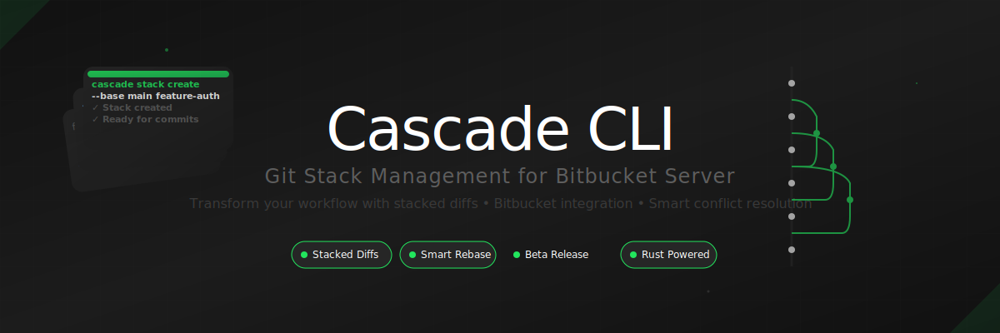

<div align="center">



[](https://rustup.rs/)
[](https://github.com/JAManfredi/cascade-cli/actions/workflows/ci.yml)
[](./docs/DEVELOPMENT.md)
[](#testing)

</div>

Cascade CLI improves Git workflows by enabling **stacked diffs** for Bitbucket Server - a powerful technique for managing chains of related commits as separate, reviewable pull requests. Perfect for feature development, bug fixes, and complex changes that benefit from incremental review.

## 📋 Table of Contents

- [✨ Key Features](#-key-features)
- [🌿 How Stacked Diffs Work: Branch Management](#-how-stacked-diffs-work-branch-management)
- [🌟 Why Stacked Diffs?](#-why-stacked-diffs)
- [🚀 Quick Start](#-quick-start)
  - [1. Installation](#1-installation)
  - [2. Initialize Your Repository](#2-initialize-your-repository)
  - [3. Create Your First Stack](#3-create-your-first-stack)
  - [4. Experience the Magic](#4-experience-the-magic)
- [🔧 Git Hooks (Recommended)](#-git-hooks-recommended)
- [⚡ Essential Commands](#-essential-commands)
- [📖 Command Reference](#-command-reference)
- [🤖 Smart Conflict Resolution](#-smart-conflict-resolution)
- [🔧 Configuration](#-configuration)
- [🎨 Advanced Features](#-advanced-features)
- [📝 Documentation](#-documentation)
- [🤝 Contributing](#-contributing)
- [🔧 Development](#-development)
- [🏗️ Architecture](#️-architecture)
- [🧪 Testing](#-testing)
- [📜 License](#-license)

## ✨ **Key Features**

### 🔄 **Stacked Diff Workflow**
- **Chain related commits** into logical, reviewable stacks
- **Independent PR reviews** while maintaining dependencies  
- **Automatic rebase management** when dependencies change
- **Smart force-push strategy** to preserve review history
- **Smart conflict resolution** - Auto-resolves 60-80% of common rebase conflicts

### 🏢 **Team Integration**

- **Bitbucket Server** native integration
- **Pull request automation** with dependency tracking  
- **Team workflow enforcement** via Git hooks
- **Progress tracking** with real-time status updates

### 🖥️ **Clean Interface**

- **Interactive TUI** for visual stack management
- **Shell completions** (bash, zsh, fish)
- **Rich visualizations** (ASCII, Mermaid, Graphviz, PlantUML)
- **Beautiful CLI** with progress bars and colored output

---

## 🌿 **How Stacked Diffs Work: Branch Management**

### **Key Insight: Each Commit = Its Own Branch + PR**

Cascade CLI **automatically creates individual branches** for each commit in your stack:

```bash
# You work normally (on main or a feature branch)
git checkout main  # or: git checkout -b my-feature-branch
ca stacks create feature-auth --base main

# Make commits as usual
git commit -m "Add user authentication endpoints"
git commit -m "Add password validation logic"  
git commit -m "Add comprehensive auth tests"

# Push to stack - Cascade CLI creates separate branches automatically:
ca push  # → Creates: add-user-authentication-endpoints
ca push  # → Creates: add-password-validation-logic  
ca push  # → Creates: add-comprehensive-auth-tests

# Submit creates individual PRs to main:
ca submit  # PR #101: add-user-authentication-endpoints → main
ca submit  # PR #102: add-password-validation-logic → main (depends on #101)
ca submit  # PR #103: add-comprehensive-auth-tests → main (depends on #102)
```

### **Two Workflow Options:**

#### **Option 1: Work on Main (Recommended for Solo Development)**
```bash
git checkout main
ca stacks create feature-name --base main
# Make commits directly on main (they stay local until you push to remote)
# Cascade CLI handles all branch creation and PR management
```

#### **Option 2: Work on Feature Branch (Team-Friendly)**  
```bash
git checkout -b feature-work
ca stacks create feature-name --base main
# Make commits on your feature branch
# Cascade CLI creates individual branches from your feature branch
# All PRs target main, not your feature branch
```

### **What You See vs. What Reviewers See:**

| **You (Developer)** | **Reviewers (Bitbucket)** |
|---|---|
| Work on 1 branch | See 3 separate PRs |
| 3 commits in sequence | Each PR focuses on 1 logical change |
| `git log` shows: A→B→C | PR #101: A, PR #102: B, PR #103: C |

### **The Magic: Auto-Generated Branch Names**

Cascade CLI creates meaningful branch names from your commit messages:

```bash
"Add user authentication endpoints"   → add-user-authentication-endpoints
"Fix login timeout bug"              → fix-login-timeout-bug  
"Refactor password validation!!!"    → refactor-password-validation
```

---

## 🌟 **Why Stacked Diffs?**

Traditional Git workflows often result in:
- **Large, hard-to-review PRs** 
- **Blocked development** waiting for reviews
- **Merge conflicts** from long-lived branches
- **Lost context** in massive changesets

**Stacked diffs solve this by:**
- ✅ **Small, focused PRs** that are easy to review
- ✅ **Parallel development** with dependency management  
- ✅ **Reduced conflicts** through frequent integration
- ✅ **Better code quality** via incremental feedback

---

## 🚀 **Quick Start**

### **1. Installation**

#### **Quick Install (Recommended)**

**Universal Script (Linux/macOS):**
```bash
curl -fsSL https://raw.githubusercontent.com/JAManfredi/cascade-cli/master/install.sh | bash
```

**Package Managers:**
```bash
# macOS - Homebrew (download formula first)
curl -O https://raw.githubusercontent.com/JAManfredi/cascade-cli/master/homebrew/cascade-cli.rb
brew install cascade-cli.rb
rm cascade-cli.rb

# Rust users
cargo install cascade-cli
```

#### **Manual Installation**

**Pre-built Binaries:**
```bash
# macOS (auto-detect architecture)
curl -L https://github.com/JAManfredi/cascade-cli/releases/latest/download/ca-macos-$(uname -m | sed 's/x86_64/x64/;s/arm64/arm64/').tar.gz | tar -xz
sudo mv ca /usr/local/bin/

# Linux (auto-detect architecture)  
curl -L https://github.com/JAManfredi/cascade-cli/releases/latest/download/ca-linux-$(uname -m | sed 's/x86_64/x64/;s/aarch64/arm64/').tar.gz | tar -xz
sudo mv ca /usr/local/bin/

# Windows (PowerShell)
Invoke-WebRequest -Uri "https://github.com/JAManfredi/cascade-cli/releases/latest/download/ca-windows-x64.exe.zip" -OutFile "ca.zip"
Expand-Archive -Path "ca.zip" -DestinationPath "$env:USERPROFILE\bin\"
```

**From Source:**
```bash
git clone https://github.com/JAManfredi/cascade-cli.git
cd cascade-cli
cargo build --release
cargo install --path .
```

See [Installation Guide](./docs/INSTALLATION.md) for detailed platform-specific instructions.

### **2. Initialize Your Repository**
```bash
# Navigate to your Git repository
cd my-project

# Quick setup wizard (recommended)
ca setup

# Or manual initialization
ca init --bitbucket-url https://bitbucket.company.com
```

### **3. Create Your First Stack**
```bash
# Create a new stack
ca stacks create feature-auth --base develop --description "User authentication system"

# Make multiple incremental commits (for your own tracking)
git add . && git commit -m "WIP: start authentication"
git add . && git commit -m "WIP: add login logic"
git add . && git commit -m "WIP: fix validation bugs"
git add . && git commit -m "Final: complete auth with tests"

# SQUASH + PUSH - Combine incremental commits into clean commit!
ca push --squash 4  # Squashes last 4 commits into 1

# OR: Make some commits normally, then squash later ones
git commit -m "Add core authentication logic"
ca push  # Push first clean commit

git commit -m "WIP: start tests"
git commit -m "WIP: more tests"  
git commit -m "Final: comprehensive test suite"

# SQUASH UNPUSHED - Only squash the last 3 commits
ca push --squash 3  # Squashes and pushes as second stack entry

# BATCH SUBMIT - Submit all unsubmitted entries as separate PRs!
ca submit

# Alternative options (for granular control):
ca push                               # Push all unpushed commits separately
ca push --since HEAD~3                # Push commits since reference
ca push --commits hash1,hash2,hash3   # Push specific commits
ca push --squash 4                    # Squash last 4 commits into 1 clean commit
ca push --squash-since HEAD~5         # Squash all commits since reference
ca submit                             # Submit all unsubmitted entries
ca submit --range 1-3                 # Submit entries 1 through 3
ca submit --range 2,4,6               # Submit specific entries
```

## 🔧 **Git Hooks (Recommended)**

Cascade CLI provides Git hooks that automate common stacked diff workflows:

| Hook Name | Purpose | When It Runs |
|-----------|---------|--------------| 
| `post-commit` | Auto-add commits to active stack with unique branch names | After every `git commit` |
| `pre-push` | Prevent force pushes, validate stack state | Before `git push` |
| `commit-msg` | Validate commit message format | During `git commit` |
| `prepare-commit-msg` | Add stack context to commit messages | Before commit message editor |

```bash
# Install all hooks for automated workflow
ca hooks install

# Remove all hooks 
ca hooks uninstall

# Check installation status
ca hooks status

# Remove specific hooks
ca hooks remove post-commit                 # Remove auto-add behavior
ca hooks remove pre-push                    # Remove push protection
ca hooks remove commit-msg                  # Remove message validation
ca hooks remove prepare-commit-msg          # Remove message enhancement
```

**🪝 Default hooks installed:**
- **Pre-push**: Prevents force pushes that break stack integrity
- **Commit-msg**: Validates commit message quality  
- **Prepare-commit-msg**: Adds helpful stack context

**📚 [Complete Hooks Guide](./docs/HOOKS.md)** - Detailed explanation of each hook, troubleshooting, and advanced usage

**💡 Pro tip**: The post-commit hook (auto-add commits to stack) is available but not installed by default to avoid conflicts with existing repo hooks.

```bash
# Install optional post-commit hook if no conflicts
ca hooks install post-commit
```

**💡 Installation Tips:**
- **For full automation**: Install all hooks with `ca hooks install`
- **For manual control**: Remove `post-commit` hook, keep others for safety
- **For team safety**: Always keep `pre-push` to prevent stack corruption

---

### **4. Experience the Magic**

```bash
# Check your stack status
ca stack
# Stack: feature-auth (3 entries)
# Entry 1: [abc123] Add authentication endpoints → PR #101
# Entry 2: [def456] Add password validation → PR #102  
# Entry 3: [ghi789] Add comprehensive tests → PR #103

# Monitor and auto-merge approved PRs
ca autoland
# ✅ Monitoring PRs for approval + passing builds
# ✅ Will auto-merge in dependency order when ready
```

### **🛡️ Safe Development Flow (Recommended)**

Cascade CLI protects against accidentally polluting your base branch:

```bash
# ✅ SAFE: Start on base branch, but work on feature branches
git checkout main
ca stacks create my-feature --base main

# Make your changes
git checkout -b feature/auth-system  # Create feature branch
git commit -am "Add user authentication"
git commit -am "Add password validation"

# Push to stack (automatically tracks source branch)
ca push  # Adds all unpushed commits to stack with source tracking
```

### **🚀 Auto-Branch Creation (Even Safer)**

Let Cascade CLI handle branch creation automatically:

```bash
# If you accidentally work on main...
git checkout main
# (make commits directly on main - oops!)

# Cascade CLI will protect you:
ca push --auto-branch  # Creates feature branch & moves commits safely
```

### **🎯 Smart Interactive Edit Mode**

When editing stack entries, Cascade CLI **intercepts your Git commands** and provides smart interactive guidance:

```bash
ca entry checkout 1  # Enter edit mode for first entry

# Just commit normally - the system takes care of the rest!
git commit

# ⚠️ You're in EDIT MODE for a stack entry!
#
# Choose your action:
#   🔄 [A]mend: Modify the current entry
#   ➕ [N]ew:   Create new entry on top (current behavior) 
#   ❌ [C]ancel: Stop and think about it
#
# Your choice (A/n/c): A
#
# ✅ Running: git commit --amend
# [Opens editor for amending]
# 💡 Entry updated! Run 'ca sync' to update PRs
```

**No more remembering commands** - just type `git commit` and Cascade guides you to the right action automatically!

### **🔍 Scattered Commit Detection & Auto-Fix**

Cascade CLI detects when you're adding commits from different Git branches to the same stack and provides automatic resolution options:

```bash
# This creates a "scattered commit" problem:
git checkout feature-branch-1
git commit -m "Add user auth"
git checkout feature-branch-2  
git commit -m "Add admin panel"
git checkout main

# When you push both to the same stack:
ca push

# ⚠️  WARNING: Scattered Commit Detection
#    You've pushed commits from different branches:
#    - feature-branch-1 (1 commit)
#    - feature-branch-2 (1 commit)
#    
#    This makes branch cleanup confusing after merge.
#    Consider organizing commits into separate stacks instead.

# 🔧 Modern Fix: Use validation to detect and resolve
ca validate --fix incorporate  # Automatically incorporate extra commits
ca validate --fix split        # Split extra commits into new stack entries
```

### **📝 Smart PR Creation**

Cascade CLI automatically generates meaningful pull request titles and descriptions:

```bash
# Create draft PRs for review:
ca submit --draft

# Each PR gets intelligent metadata:
# ┌─ PR Title: Generated from commit messages
# ├─ Description: Combines commit details & context  
# ├─ Branch: Auto-created with semantic naming
# └─ Target: Points to previous stack entry or base

# Custom titles and descriptions:
ca submit 2 --title "Add advanced user auth" --description "Implements JWT tokens with refresh capabilities"

# Default behavior (auto-generated):
ca submit  # Creates well-structured PRs
```

**How PR Content is Generated:**
- **Title**: Uses your commit message or most significant change
- **Description**: Includes commit details, file changes, and stack context
- **Branch Context**: Shows relationship to previous entries
- **Target Branch**: Automatically set to build on previous stack entry

### **Daily Development Flow**

Cascade CLI follows a simple, powerful workflow optimized for modern development:

```bash
# 1. Create & Develop
ca stacks create feature-name --base main
git commit -m "Add core functionality"
git commit -m "Add comprehensive tests"

# 2. Push & Submit (with modern shortcuts)
ca push --squash 2    # Combine commits into reviewable unit
ca submit            # Create PR with automatic dependency tracking

# 3. Auto-Land (set and forget)
ca autoland          # Monitors and merges when approved + tests pass

# 4. Iterate (if review feedback)
git commit --amend   # Update based on feedback
ca sync              # Update all dependent PRs automatically
```

**🔄 Advanced Workflows**: See our comprehensive [**Workflows Guide**](./docs/WORKFLOWS.md) for complex scenarios including:
- Multi-commit stacks with dependencies
- Handling review feedback on middle commits  
- Managing emergency hotfixes during feature development
- Cross-team collaboration patterns
- Base branch updates with smart force push
- Modern WIP-to-clean commit workflows

---

## 🤖 **Smart Conflict Resolution**

### **Automatic Conflict Resolution**

Cascade CLI automatically resolves 60-80% of common rebase conflicts using intelligent pattern recognition.

### **✅ Resolved Automatically**
- **Import statement conflicts** - Merges and deduplicates imports
- **Dependency version conflicts** - Uses latest compatible versions  
- **Simple formatting conflicts** - Applies consistent code style
- **Non-overlapping changes** - Safely combines independent modifications

### **How It Works**
- **Pattern Recognition**: Analyzes conflict types using AST parsing
- **Safe Resolution**: Only resolves conflicts with zero ambiguity
- **Manual Fallback**: Escalates complex conflicts to developer review
- **Audit Trail**: Logs all automatic resolutions for transparency

```bash
# Smart conflict resolution in action
ca rebase
# 🤖 Auto-resolved 3 import conflicts in src/auth.rs
# 🤖 Auto-resolved 1 dependency conflict in package.json
# ⚠️  Manual resolution needed: 1 logic conflict in src/validation.rs
```

### **Supported File Types for Import Resolution**
- **JavaScript/TypeScript** (`.js`, `.ts`, `.jsx`, `.tsx`)
- **Python** (`.py`)
- **Rust** (`.rs`)
- **Swift** (`.swift`) 
- **Kotlin** (`.kt`)
- **C#** (`.cs`)

### **Benefits**
- **Faster rebases** - No manual intervention for simple conflicts
- **Consistent results** - Deterministic conflict resolution
- **Reduced errors** - Eliminates common merge mistakes
- **Learning system** - Improves resolution patterns over time

### **Configuration**
```bash
# Enable/disable smart resolution
ca config set conflicts.auto_resolve true
ca config set conflicts.file_types "js,ts,py,rs"
ca config set conflicts.backup_on_resolve true
```

---

## ⚡ **Essential Commands**

```bash
# Stack Management (Multiple Stacks)
ca stacks create <name> --base <branch>  # Create new stack
ca stacks list                          # List all stacks
ca switch <name>                        # Switch active stack
ca push                                 # Add commits to current stack
ca submit                               # Submit PRs for current stack

# Current Stack Operations (Shortcuts)
ca stack                                # Show current stack details
ca push                                 # Push commits to stack
ca land                                 # Merge approved PRs
ca autoland                             # Auto-merge all ready PRs
ca sync                                 # Sync with remote repository
ca rebase                               # Rebase stack on updated base

# Branch Management & Safety
ca deactivate                           # Turn off stack mode
ca switch <name>                        # Switch to different stack

# Or use full commands when needed:
ca deactivate                           # Turn off stack mode (use normal Git workflow)  
ca switch <name>                        # Switch to different stack

# 🔍 Automatic branch change detection: Cascade detects when you switch branches
#     and prompts you to continue with current stack, deactivate, or switch stacks

# Entry Editing (Modern Convenience)
ca entry checkout [number]              # Interactive checkout for editing entries
ca entry status                         # Show current edit mode status  
ca entry list                           # List all entries with edit indicators

# Repository Overview
ca repo                                 # Show all stacks and repository status
```

**💡 Pro tip**: Use `ca stack` for current stack details, `ca repo` for everything overview.

---

## 📖 **Command Reference**

### **Stack Management**
```bash
# Create and manage stacks
ca stacks create <name>                       # Create new stack (uses default base branch)
ca stacks create <name> --base <branch>       # Create stack with specific base branch
ca stacks create <name> -b <branch>           # Short form
ca stacks create <name> --description <desc>  # Add description
ca stacks create <name> -d <desc>             # Short form

# List stacks
ca stacks list                                # Show basic stack list
ca stacks list --verbose                      # Show detailed information
ca stacks list -v                             # Short form
ca stacks list --active                       # Show only active stack
ca stacks list --format <format>              # Custom output format

# Switch and view stacks
ca switch <name>                              # Activate stack
ca stack                                      # Show current stack details
ca stacks delete <name>                       # Remove stack
ca stacks delete <name> --force               # Force deletion without confirmation
ca validate                                   # Validate active stack
ca validate <name>                            # Validate specific stack
```

### **Entry Editing (Modern Convenience)**
```bash
# Checkout specific entries for editing
ca entry checkout                           # Interactive picker to select entry
ca entry checkout 1                         # Checkout first entry for editing
ca entry checkout 3 --yes                   # Skip confirmation prompts
ca entry checkout 2 --direct                # Skip picker when using entry number

# Track edit status
ca entry status                             # Show current edit mode info
ca entry status --quiet                     # Brief status only
ca entry list                               # List all entries with edit status
ca entry list --verbose                     # Show detailed entry information
```

### **Adding Commits to Stack**
```bash
# Basic push operations
ca push                                      # Add current commit (HEAD) to stack
ca push --branch <name>                      # Custom branch name for this commit
ca push -b <name>                            # Short form
ca push --message <msg>                      # Custom commit message
ca push -m <msg>                             # Short form  
ca push --commit <hash>                      # Push specific commit instead of HEAD

# Batch operations
ca push                                      # Push all unpushed commits separately
ca push --since HEAD~3                       # Push commits since reference
ca push --commits hash1,hash2,hash3          # Push specific commits

# Smart squash operations
ca push --squash 4                           # Squash last 4 commits into 1 clean commit
ca push --squash-since HEAD~5                # Squash all commits since reference

# Remove from stack
ca pop                                       # Remove top entry from stack
ca pop --keep-branch                         # Keep the branch when popping
```

### **Pull Request Workflow**
```bash
# Submit for review
ca submit                                    # Submit top entry (creates PR)
ca submit 2                                  # Submit specific entry number
ca submit --title <title>                    # Custom PR title
ca submit -t <title>                         # Short form
ca submit --description <desc>               # Custom PR description
ca submit -d <desc>                          # Short form
ca submit --draft                            # Create as draft PR (can be edited later)

# Batch submission
ca submit                                    # Submit all unsubmitted entries
ca submit --range 1-3                        # Submit entries 1 through 3
ca submit --range 2,4,6                      # Submit specific entries

# Status and management
ca stacks status                             # Show active stack PR status
ca stacks status <name>                      # Show specific stack PR status
ca stacks prs                                # List all repository PRs
ca stacks prs --state open                   # Filter by state (open/merged/declined)
ca stacks prs --verbose                      # Show detailed PR information
ca stacks prs -v                             # Short form
```

### **Sync and Rebase Operations**
```bash
# Sync with remote
ca sync                                      # Sync active stack with remote
ca sync --force                              # Force sync even with conflicts

# Rebase operations
ca rebase                                    # Rebase stack on latest base branch
ca rebase --interactive                      # Interactive rebase mode
ca rebase -i                                 # Short form
ca rebase --onto <branch>                    # Rebase onto different target branch
ca rebase --strategy force-push              # Industry standard (default)
ca rebase --strategy interactive             # Manual conflict resolution mode

# Rebase conflict resolution
ca stacks continue-rebase                    # Continue after resolving conflicts
ca stacks abort-rebase                       # Abort rebase operation
ca stacks rebase-status                      # Show rebase status and guidance
```

### **Advanced Tools**
```bash
# Interactive interfaces
ca tui                                      # Launch terminal user interface

# Visualization and diagramming
ca viz stack                                # ASCII stack diagram for active stack
ca viz stack <name>                         # ASCII diagram for specific stack
ca viz deps                                 # Show dependency relationships
ca viz deps --format mermaid                # Export as Mermaid diagram
ca viz deps --format dot                    # Export as Graphviz DOT
ca viz deps --format plantuml               # Export as PlantUML
ca viz deps --output <file>                 # Save to file

# Git hooks integration
ca hooks install                            # Install all Git hooks
ca hooks uninstall                          # Remove all Git hooks
ca hooks status                             # Show hook installation status

# Individual hook management
ca hooks add post-commit                    # Install specific hook
ca hooks add pre-push                       # Install push protection  
ca hooks add commit-msg                     # Install commit message validation
ca hooks add prepare-commit-msg             # Install commit message enhancement
ca hooks remove post-commit                 # Remove specific hook
ca hooks remove pre-push                    # Remove push protection
ca hooks remove commit-msg                  # Remove message validation
ca hooks remove prepare-commit-msg          # Remove message enhancement

# Configuration and setup
ca setup                                    # Interactive setup: config + hooks + completions
ca completions install                      # Install shell completions
ca completions status                       # Check completion status
ca completions generate bash                # Generate completions for bash
ca completions generate zsh                 # Generate completions for zsh
ca completions generate fish                # Generate completions for fish

# System information
ca version                                  # Show version information
ca doctor                                   # Run system diagnostics
ca cleanup                                  # Clean up orphaned temp branches (dry-run)
ca cleanup --execute                        # Actually delete temp branches
```

---

## 🔧 **Configuration**

### **Bitbucket Setup**
```bash
# Interactive wizard (recommended)
ca setup

# Manual configuration
ca config set bitbucket.url "https://bitbucket.company.com"
ca config set bitbucket.project "PROJECT"
ca config set bitbucket.repository "repo-name"
ca config set bitbucket.token "your-personal-access-token"
ca config set bitbucket.username "your-username"
ca config set auth.method "token"  # or "basic"
ca config set default_reviewers "reviewer1,reviewer2"
ca config set stack.default_base "main"
```

### **PR Description Templates**

Cascade CLI supports configurable PR description templates that automatically apply to all pull requests:

```bash
# Set a PR description template (supports markdown)
ca config set cascade.pr_description_template "## Summary
Brief description of changes

## Testing
- [ ] Unit tests pass
- [ ] Manual testing completed

## Checklist
- [ ] Code review completed
- [ ] Documentation updated"

# View current template
ca config get cascade.pr_description_template

# Remove template (fallback to --description or commit messages)
ca config set cascade.pr_description_template ""
```

**Template Behavior:**
- **With template configured**: Template is ALWAYS used for all PRs (overrides `--description`)
- **Without template**: Uses `--description` argument or commit message body as fallback
- **Automatic stack hierarchy**: All PRs automatically get a stack information footer showing the hierarchy and current position

**Setup Integration:**
The `ca setup` command includes an optional step to configure the PR template with an example template or custom content.

---

## 🎨 **Advanced Features**

### **Terminal User Interface**
Launch `ca tui` for an interactive stack browser with:
- Real-time stack visualization
- Keyboard navigation (↑/↓/Enter/q)
- Live status updates
- Error handling and recovery

### **Visualization Export**
```bash
# Generate diagrams for documentation
ca viz stack --format mermaid --output docs/stack.md
ca viz deps --format dot --output diagrams/deps.dot

# Include in CI/CD pipeline
ca viz deps --format plantuml | plantuml -pipe > architecture.png
```

### **Shell Integration**
```bash
# Install completions
ca completions install

# Check installation
ca completions status

# Manual installation
ca completions generate bash > /etc/bash_completion.d/ca
```

---

## 📝 **Documentation**

- 📚 **[User Manual](./docs/USER_MANUAL.md)** - Complete command reference
- 🚀 **[Installation Guide](./docs/INSTALLATION.md)** - Platform-specific instructions
- 🎓 **[Onboarding Guide](./docs/ONBOARDING.md)** - Step-by-step tutorial
- 🔧 **[Configuration Reference](./docs/CONFIGURATION.md)** - All settings explained
- 🐛 **[Troubleshooting](./docs/TROUBLESHOOTING.md)** - Common issues and solutions
- 🏗️ **[Architecture](./docs/ARCHITECTURE.md)** - Internal design and extending
- 📋 **[Smart Force Push Strategy](./docs/EDIT_FLOWS_INTEGRATION.md)** - How PR history is preserved
- 🛠️ **[Development Scripts](./docs/SCRIPTS.md)** - CI debugging and development tools

---

## 🤝 **Contributing**

We welcome contributions! See our [Contributing Guide](./docs/CONTRIBUTING.md) for details.

### **Development Setup**
```bash
git clone https://github.com/JAManfredi/cascade-cli.git
cd cascade-cli
cargo build
cargo test
```

### **Release Process**
See [Release Guide](./docs/RELEASING.md) for maintainer instructions.

---

## 🔧 **Development**

### **Quick Development Setup**

```bash
# Clone and build
git clone https://github.com/jared/cascade-cli.git
cd cascade-cli
cargo build
```

### **Pre-Push Validation**

**Always validate before pushing to GitHub!** Run our comprehensive check script:

```bash
./scripts/pre-push-check.sh
```

This runs all the same checks as CI:
- ✅ Code formatting and linting
- ✅ Unit and integration tests  
- ✅ Documentation generation
- ✅ Binary compilation

**💡 Pro Tip**: Set up a git hook to run this automatically:
```bash
# Add to .git/hooks/pre-push
#!/bin/sh
./scripts/pre-push-check.sh
```

### **CI Debugging Tools**

Having trouble with CI failures that don't reproduce locally? We have specialized tools for that:

📋 **[Development Scripts Guide](./docs/SCRIPTS.md)** - Complete reference for all CI debugging and development scripts

See [`docs/DEVELOPMENT.md`](docs/DEVELOPMENT.md) for complete development guidelines, testing strategies, and contribution workflows.

---

## 🏗️ **Architecture**

Cascade CLI is built with:
- **🦀 Rust** - Performance, safety, and reliability
- **📚 git2** - Native Git operations without subprocess overhead
- **🌐 HTTP/REST** - Direct Bitbucket API integration  
- **🎨 TUI Libraries** - Rich terminal interfaces (ratatui, crossterm)
- **⚡ Async** - Non-blocking operations with tokio

### **Design Principles**
- **Smart Force Push** - Preserves review history while enabling safe rebases
- **Atomic Operations** - All-or-nothing state changes
- **Conflict Detection** - Early detection with resolution guidance
- **Graceful Degradation** - Continue working when services are unavailable

---

## 🧪 **Testing**

```bash
# Run full test suite
cargo test -- --test-threads=1

# Tests cover:
# - Core stack management (40 tests)
# - Git operations and safety
# - Bitbucket integration  
# - CLI command functionality
# - Error handling and recovery
```

**Test Coverage**: 141 tests passing ✅

---

## 📜 **License**

This project is licensed under the MIT License - see the [LICENSE](LICENSE) file for details.

---

<p align="center">
  <strong>📚 Transform your Git workflow with Cascade CLI</strong><br>
  <em>Stack management for modern development teams</em>
</p>

