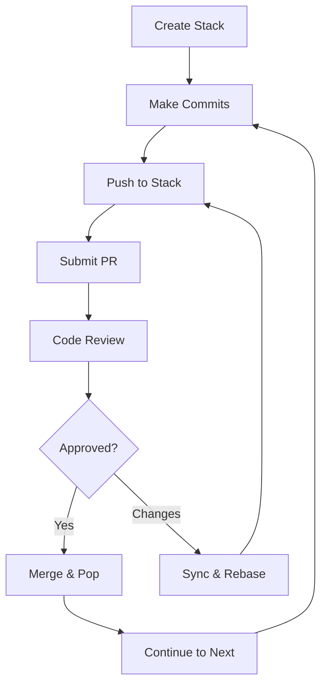

# 📚 Cascade CLI - Git Stack Management for Teams

> **Professional Git workflow management with stacked diffs and seamless Bitbucket integration**

[](https://rustup.rs/)
[](./PRODUCTION_CHECKLIST.md)
[](#testing)

Cascade CLI revolutionizes Git workflows by enabling **stacked diffs** - a powerful technique for managing chains of related commits as separate, reviewable pull requests. Perfect for feature development, bug fixes, and complex changes that benefit from incremental review.

## ✨ **Key Features**

### 🔄 **Stacked Diff Workflow**
- **Chain related commits** into logical, reviewable stacks
- **Independent PR reviews** while maintaining dependencies  
- **Automatic rebase management** when dependencies change
- **Smart force-push strategy** to preserve review history

### 🏢 **Enterprise Integration**
- **Bitbucket Server/Cloud** native integration
- **Pull request automation** with dependency tracking
- **Team workflow enforcement** via Git hooks
- **Progress tracking** with real-time status updates

### 🖥️ **Professional Interface**
- **Interactive TUI** for visual stack management
- **Shell completions** (bash, zsh, fish)
- **Rich visualizations** (ASCII, Mermaid, Graphviz, PlantUML)
- **Beautiful CLI** with progress bars and colored output

---

## 🌿 **How Stacked Diffs Work: Branch Management**

### **Key Insight: Each Commit = Its Own Branch + PR**

Cascade CLI **automatically creates individual branches** for each commit in your stack:

```bash
# You work normally (on main or a feature branch)
git checkout main  # or: git checkout -b my-feature-branch
cc stack create feature-auth --base main

# Make commits as usual
git commit -m "Add user authentication endpoints"
git commit -m "Add password validation logic"  
git commit -m "Add comprehensive auth tests"

# Push to stack - Cascade CLI creates separate branches automatically:
cc stack push  # → Creates: add-user-authentication-endpoints
cc stack push  # → Creates: add-password-validation-logic  
cc stack push  # → Creates: add-comprehensive-auth-tests

# Submit creates individual PRs to main:
cc stack submit  # PR #101: add-user-authentication-endpoints → main
cc stack submit  # PR #102: add-password-validation-logic → main (depends on #101)
cc stack submit  # PR #103: add-comprehensive-auth-tests → main (depends on #102)
```

### **Two Workflow Options:**

#### **Option 1: Work on Main (Recommended for Solo Development)**
```bash
git checkout main
cc stack create feature-name --base main
# Make commits directly on main (they stay local until you push to remote)
# Cascade CLI handles all branch creation and PR management
```

#### **Option 2: Work on Feature Branch (Team-Friendly)**  
```bash
git checkout -b feature-work
cc stack create feature-name --base main
# Make commits on your feature branch
# Cascade CLI creates individual branches from your feature branch
# All PRs target main, not your feature branch
```

### **What You See vs. What Reviewers See:**

| **You (Developer)** | **Reviewers (Bitbucket)** |
|---|---|
| Work on 1 branch | See 3 separate PRs |
| 3 commits in sequence | Each PR focuses on 1 logical change |
| `git log` shows: A→B→C | PR #101: A, PR #102: B, PR #103: C |

### **The Magic: Auto-Generated Branch Names**

Cascade CLI creates meaningful branch names from your commit messages:

```bash
"Add user authentication endpoints"   → add-user-authentication-endpoints
"Fix login timeout bug"              → fix-login-timeout-bug  
"Refactor password validation!!!"    → refactor-password-validation
```

---

## 🚀 **Quick Start**

### **1. Installation**

#### **From Source (Recommended)**
```bash
# Clone and build
git clone https://github.com/JAManfredi/cascade-cli.git
cd cascade-cli
cargo build --release

# Add to PATH
export PATH="$PWD/target/release:$PATH"
```

#### **Pre-built Binaries** *(Coming Soon)*
```bash
# macOS/Linux
curl -L https://github.com/JAManfredi/cascade-cli/releases/latest/download/cc | sh

# Windows
# Download from GitHub releases
```

### **2. Initialize Your Repository**
```bash
# Navigate to your Git repository
cd my-project

# Quick setup wizard (recommended)
cc setup

# Or manual initialization
cc init --bitbucket-url https://bitbucket.company.com
```

### **3. Create Your First Stack**
```bash
# Create a new stack
cc stack create feature-auth --base develop --description "User authentication system"

# Make multiple commits
git add . && git commit -m "Add login endpoint"
git add . && git commit -m "Add password validation"
git add . && git commit -m "Add user sessions"

# 🎉 NEW: BATCH PUSH - Add all 3 commits at once!
cc stack push --all

# 🎉 NEW: BATCH SUBMIT - Submit all entries as separate PRs!
cc stack submit --all

# Alternative batch options:
cc stack push --since HEAD~3                    # Push last 3 commits
cc stack push --commits abc123,def456,ghi789    # Push specific commits
cc stack submit --range 1-3                     # Submit entries 1 through 3
cc stack submit --range 2,4,6                   # Submit entries 2, 4, and 6
```

### **4. Experience the Magic**
```bash
# Interactive stack browser
cc tui

# Visualize your stacks
cc viz deps --format mermaid

# Auto-install Git hooks
cc hooks install
```

---

## 🎯 **Core Workflow**

### **The Stack Lifecycle**



### **1. Stack Creation**
```bash
# Create a logical grouping for related changes
cc stack create feature-name --base main
cc stack create fix-bug-123 --base develop
```

### **2. Commit Management**
```bash
# Add commits to your active stack
git commit -m "Implement core feature"
cc stack push

git commit -m "Add comprehensive tests"  
cc stack push
```

### **3. Pull Request Submission**
```bash
# Submit individual commits as separate PRs
cc stack submit      # Submit top commit
cc stack submit 1    # Submit specific stack entry
```

### **4. Dependency Management**
```bash
# When base changes, sync your stack
cc stack sync

# Rebase stack entries safely
cc stack rebase --strategy cherry-pick
```

---

## 🔄 **Complex Workflow Examples**

### **Scenario 1: Code Review Feedback on Middle Commit**

You have a 3-commit stack and need to modify the middle commit based on review feedback:

```bash
# Your stack: A -> B -> C (need to modify B)
cc stack show
# Entry 1: [abc123] Add authentication endpoints    (PR #101 - Open)
# Entry 2: [def456] Add password validation        (PR #102 - Changes Requested) ← Need to fix
# Entry 3: [ghi789] Add user registration tests    (PR #103 - Open)

# Checkout the specific commit that needs changes
git checkout def456

# Make your changes based on review feedback
git add .
git commit --amend -m "Add password validation (addressed security review)"

# This creates a new commit hash - rebase the stack to update dependencies
cc stack rebase

# What happens:
🔄 Rebasing stack: authentication
   ✅ Force-pushed new content to existing branches (preserves PR #101, #102, #103)
   ✅ All dependent commits automatically updated
   ✅ Review history preserved on all PRs

# PRs #101, #102, #103 now show updated code but keep all comments/approvals
```

### **Scenario 2: Base Branch Updates (Smart Force Push)**

Main branch gets updated while you're working on a feature stack:

```bash
# Your feature stack is based on old main
cc stack show
# Base: main (behind by 5 commits)
# Entry 1: [abc123] Implement OAuth flow
# Entry 2: [def456] Add OAuth tests

# Main branch has new commits - sync your stack
git checkout main && git pull  # Get latest main

# Rebase your entire stack on updated main
cc stack rebase

# Smart force push preserves all PR history:
🔄 Rebasing stack: oauth-feature
   📋 Branch mapping:
      implement-oauth -> implement-oauth-v2
      oauth-tests -> oauth-tests-v2
   
   🔄 Preserved pull request history:
      ✅ Force-pushed implement-oauth-v2 to implement-oauth (preserves PR #105)
      ✅ Force-pushed oauth-tests-v2 to oauth-tests (preserves PR #106)
   
   ✅ Stack rebased on latest main
   ✅ All review comments and approvals preserved
   ✅ Backup branches created: implement-oauth-v2, oauth-tests-v2
```

### **Scenario 3: Modifying First Commit in Stack**

Need to change the foundation commit that other commits depend on:

```bash
# Stack with dependencies: A -> B -> C (need to modify A)
cc stack show  
# Entry 1: [abc123] Add database schema     (PR #110)
# Entry 2: [def456] Add user model         (PR #111) ← depends on schema
# Entry 3: [ghi789] Add user endpoints     (PR #112) ← depends on model

# Checkout and modify the first commit
git checkout abc123
git add .
git commit --amend -m "Add database schema (fixed column types)"

# Rebase entire stack to update all dependencies
cc stack rebase

# All dependent commits automatically incorporate the schema changes
# All PRs (#110, #111, #112) updated with new code but preserve review history
```

### **Scenario 4: Managing Multiple Related Stacks**

Working on authentication feature that depends on database changes from another team:

```bash
# Create dependent stack
cc stack create auth-endpoints --base user-database --description "Auth endpoints (depends on DB stack)"

# Check dependencies
cc viz deps --format ascii
┌─────────────────┐    ┌─────────────────┐
│ user-database   │────│ auth-endpoints  │
│ (Team A)        │    │ (Your stack)    │
└─────────────────┘    └─────────────────┘

# When Team A's database stack gets updated:
# 1. Their changes merge to main
# 2. Update your base reference
cc stack sync  # Automatically rebases your stack on latest user-database changes

# Your auth stack automatically incorporates database changes while preserving your work
```

### **Scenario 5: Handling Merge Conflicts During Rebase**

When automatic rebase fails due to conflicts:

```bash
cc stack rebase
# ❌ Merge conflict in src/auth.rs
# ❌ Rebase paused - resolve conflicts and continue

# Resolve conflicts in your editor
vim src/auth.rs  # Fix conflicts manually

# Mark conflicts as resolved
git add src/auth.rs

# Continue the rebase
cc stack rebase --continue

# ✅ Rebase completed
# ✅ All PRs updated with conflict resolution
# ✅ Review history preserved
```

### **Scenario 6: Emergency Hotfix with Parallel Development**

Need to create urgent hotfix while feature work continues:

```bash
# Currently working on feature stack
cc stack list
# * feature-oauth (active)
#   user-profiles

# Create urgent hotfix stack
cc stack create security-patch --base main --description "Emergency security fix"

# Work on hotfix (feature-oauth stack paused)
git add . && git commit -m "Fix authentication vulnerability"
cc stack push
cc stack submit --priority high

# Switch back to feature work  
cc stack switch feature-oauth

# Continue feature development in parallel
git add . && git commit -m "Add OAuth scope validation"
cc stack push

# Both stacks managed independently with separate PRs
```

### **Scenario 7: Stack Cleanup After Merges**

Managing stacks after some commits get merged:

```bash
# Stack with mixed merge status
cc stack prs
# Entry 1: [abc123] Add user model         (PR #120 - Merged ✅)
# Entry 2: [def456] Add user validation    (PR #121 - Open)
# Entry 3: [ghi789] Add user endpoints     (PR #122 - Open)

# Remove merged entries from stack
cc stack pop 1  # Remove merged commit from stack

# Rebase remaining entries on latest main (includes merged changes)
git checkout main && git pull
cc stack rebase

# Stack now cleanly continues from merged base
cc stack show
# Entry 1: [def456] Add user validation    (PR #121)
# Entry 2: [ghi789] Add user endpoints     (PR #122)
```

---

## 📖 **Command Reference**

### **Stack Management**
```bash
cc stack create <name>           # Create new stack
cc stack list                    # Show all stacks  
cc stack switch <name>           # Activate stack
cc stack push                    # Add current commit to stack
cc stack push --all              # 🎉 Add all unpushed commits at once
cc stack push --since HEAD~3     # 🎉 Add last 3 commits  
cc stack push --commits a,b,c    # 🎉 Add specific commits
cc stack pop                     # Remove top entry from stack
cc stack show                    # Display stack details
cc stack delete <name>           # Remove stack
```

### **Pull Request Workflow** 
```bash
cc stack submit [entry]          # Create PR for entry
cc stack submit --all            # 🎉 Submit all unsubmitted entries
cc stack submit --range 1-3      # 🎉 Submit entries 1 through 3
cc stack submit --range 2,4,6    # 🎉 Submit specific entries
cc stack status                  # Show PR status
cc stack prs                     # List all PRs
cc stack sync                    # Sync with remote changes
cc stack rebase                  # Rebase stack on latest base
```

### **Advanced Tools**
```bash
cc tui                           # Launch interactive TUI
cc viz stack                     # ASCII stack diagram
cc viz deps --format mermaid     # Dependency graph
cc hooks install                 # Install Git hooks
cc setup                         # Interactive configuration
```

---

## 🔧 **Configuration**

### **Bitbucket Setup**
```bash
# Interactive wizard (recommended)
cc setup

# Manual configuration
cc config set bitbucket.url "https://bitbucket.company.com"
cc config set bitbucket.project "PROJECT"
cc config set bitbucket.repository "repo-name"
cc config set bitbucket.token "your-personal-access-token"
```

### **Git Hooks (Optional)**
```bash
# Install all hooks for automated workflow
cc hooks install

# Check status
cc hooks status

# Individual hook management
cc hooks add post-commit
cc hooks remove pre-push
```

---

## 🎨 **Advanced Features**

### **Terminal User Interface**
Launch `cc tui` for an interactive stack browser with:
- Real-time stack visualization
- Keyboard navigation (↑/↓/Enter/q)
- Live status updates
- Error handling and recovery

### **Visualization Export**
```bash
# Generate diagrams for documentation
cc viz stack --format mermaid --output docs/stack.md
cc viz deps --format dot --output diagrams/deps.dot

# Include in CI/CD pipeline
cc viz deps --format plantuml | plantuml -pipe > architecture.png
```

### **Shell Integration**
```bash
# Install completions
cc completions install

# Check installation
cc completions status

# Manual installation
cc completions generate bash > /etc/bash_completion.d/cc
```

---

## 🏗️ **Architecture**

Cascade CLI is built with:
- **🦀 Rust** - Performance, safety, and reliability
- **📚 git2** - Native Git operations without subprocess overhead
- **🌐 HTTP/REST** - Direct Bitbucket API integration  
- **🎨 TUI Libraries** - Rich terminal interfaces (ratatui, crossterm)
- **⚡ Async** - Non-blocking operations with tokio

### **Design Principles**
- **Smart Force Push** - Preserves review history while enabling safe rebases
- **Atomic Operations** - All-or-nothing state changes
- **Conflict Detection** - Early detection with resolution guidance
- **Graceful Degradation** - Continue working when services are unavailable

---

## 🧪 **Testing**

```bash
# Run full test suite
cargo test -- --test-threads=1

# Tests cover:
# - Core stack management (40 tests)
# - Git operations and safety
# - Bitbucket integration  
# - CLI command functionality
# - Error handling and recovery
```

**Test Coverage**: 40/40 tests passing ✅

---

## 🤝 **Contributing**

We welcome contributions! See our [Contributing Guide](./docs/CONTRIBUTING.md) for details.

### **Development Setup**
```bash
git clone https://github.com/JAManfredi/cascade-cli.git
cd cascade-cli
cargo build
cargo test
```

### **Release Process**
See [Release Guide](./docs/RELEASING.md) for maintainer instructions.

---

## 📝 **Documentation**

- 📚 **[User Manual](./docs/USER_MANUAL.md)** - Complete command reference
- 🚀 **[Installation Guide](./docs/INSTALLATION.md)** - Platform-specific instructions
- 🎓 **[Onboarding Guide](./docs/ONBOARDING.md)** - Step-by-step tutorial
- 🔧 **[Configuration Reference](./docs/CONFIGURATION.md)** - All settings explained
- 🐛 **[Troubleshooting](./docs/TROUBLESHOOTING.md)** - Common issues and solutions
- 🏗️ **[Architecture](./docs/ARCHITECTURE.md)** - Internal design and extending
- 📋 **[Smart Force Push Strategy](./EDIT_FLOWS_INTEGRATION.md)** - How PR history is preserved

---

## 📜 **License**

This project is licensed under the MIT License - see the [LICENSE](LICENSE) file for details.

---

## 🌟 **Why Stacked Diffs?**

Traditional Git workflows often result in:
- **Large, hard-to-review PRs** 
- **Blocked development** waiting for reviews
- **Merge conflicts** from long-lived branches
- **Lost context** in massive changesets

**Stacked diffs solve this by:**
- ✅ **Small, focused PRs** that are easy to review
- ✅ **Parallel development** with dependency management  
- ✅ **Reduced conflicts** through frequent integration
- ✅ **Better code quality** via incremental feedback

---

<p align="center">
  <strong>📚 Transform your Git workflow with Cascade CLI</strong><br>
  <em>Professional stack management for modern development teams</em>
</p>