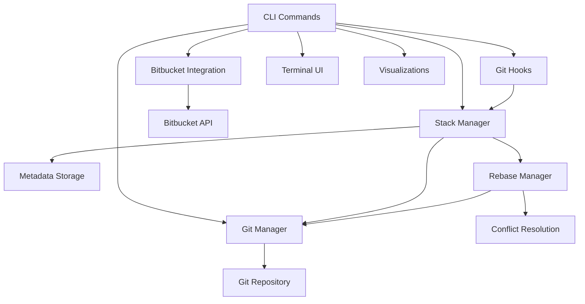
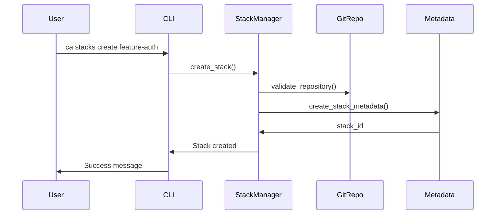
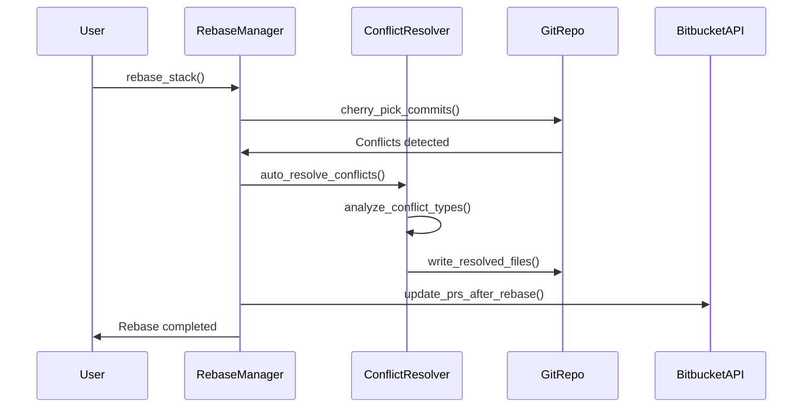
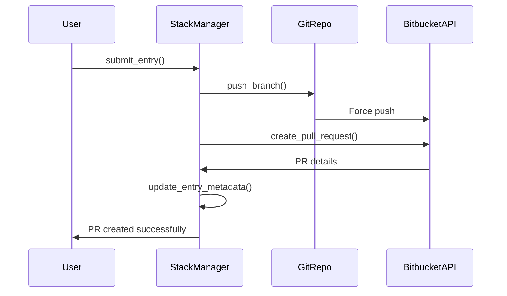

# 🏗️ Architecture Guide

This document explains the internal architecture of Cascade CLI, how different components interact, and how to extend the system.

## 📋 **Table of Contents**

- [System Overview](#-system-overview)
- [Core Components](#-core-components)
- [Data Flow](#-data-flow)
- [Integration Points](#-integration-points)
- [Extension Points](#-extension-points)
- [Error Handling Strategy](#-error-handling-strategy)
- [Contributing Guide](#-contributing-guide)

---

## 🌐 **System Overview**

Cascade CLI is built as a **modular Rust application** that orchestrates Git operations, manages metadata, and integrates with external services (Bitbucket) to enable stacked diff workflows.

### **High-Level Architecture**



### **Design Principles**

1. **Separation of Concerns** - Each module has a single responsibility
2. **Error Propagation** - Comprehensive error handling with context
3. **Git Safety** - Never lose user data, always provide recovery options
4. **API Abstraction** - Bitbucket integration is pluggable for future platforms
5. **Async Operations** - Non-blocking I/O for external API calls

---

## 🔧 **Core Components**

### **1. CLI Layer (`src/cli/`)**

**Purpose**: User interface and command orchestration

```rust
// Command structure
src/cli/
├── commands/          # Individual command implementations
│   ├── stack.rs      # Stack management commands
│   ├── init.rs       # Repository initialization
│   ├── hooks.rs      # Git hooks management
│   ├── tui.rs        # Terminal user interface
│   └── viz.rs        # Visualization commands
└── mod.rs            # CLI argument parsing and routing
```

**Key Responsibilities**:
- Argument parsing and validation
- Command routing and execution
- User feedback (progress bars, colored output)
- Error presentation

### **2. Stack Management (`src/stack/`)**

**Purpose**: Core business logic for managing commit stacks

```rust
src/stack/
├── manager.rs        # High-level stack operations
├── stack.rs          # Stack data structure and operations
├── metadata.rs       # Persistent metadata management
└── rebase.rs         # Rebase operations and conflict resolution
```

**Key Components**:

- **`StackManager`** - High-level operations (create, delete, list stacks)
- **`Stack`** - Individual stack with entries and metadata
- **`StackEntry`** - Single commit in a stack with branch and PR info
- **`RebaseManager`** - Handles rebasing with smart conflict resolution

### **3. Git Integration (`src/git/`)**

**Purpose**: Safe Git operations and repository management

```rust
src/git/
├── repository.rs     # Git repository operations
└── branch_manager.rs # Branch naming and management
```

**Key Features**:
- **Safe Git Operations** - Validates state before destructive operations
- **Branch Management** - Auto-generates meaningful branch names
- **Conflict Detection** - Identifies and categorizes merge conflicts
- **Recovery Options** - Provides rollback mechanisms

### **4. Bitbucket Integration (`src/bitbucket/`)**

**Purpose**: External API integration for PR management

```rust
src/bitbucket/
├── client.rs         # HTTP client and authentication
├── integration.rs    # High-level Bitbucket operations
├── pull_request.rs   # PR data structures
└── mod.rs           # Public API surface
```

**Key Features**:
- **PR Lifecycle Management** - Create, update, merge PRs
- **Smart Force Push Integration** - Updates PRs while preserving history
- **Rate Limiting** - Respects API limits with exponential backoff
- **Error Recovery** - Handles network failures gracefully

### **5. Configuration (`src/config/`)**

**Purpose**: Settings management and authentication

```rust
src/config/
├── settings.rs       # Application configuration
└── auth.rs          # Authentication management
```

---

## 🔄 **Data Flow**

### **Stack Creation Flow**



### **Rebase with Smart Conflict Resolution**



### **PR Submission Flow**



---

## 🔌 **Integration Points**

### **Git Hooks Integration**

Cascade CLI installs Git hooks that automatically manage stacks:

```bash
# Pre-commit hook
.git/hooks/pre-commit
├── Validates commit in stack context
├── Prevents commits that would break stack integrity
└── Updates stack metadata

# Post-commit hook  
.git/hooks/post-commit
├── Automatically adds new commits to active stack
├── Updates stack entry metadata
└── Triggers dependent stack updates
```

### **Bitbucket API Integration**

**Authentication Methods**:
- Personal Access Tokens (recommended)
- Username/Password (legacy)

**Key API Operations**:
- Create/update/merge pull requests
- Branch management and force pushing
- Repository metadata and permissions

### **Terminal UI Integration**

The TUI is built with `ratatui` and provides:

```rust
// TUI Architecture
AppState {
    current_view: View,           // Stack list, Stack detail, Help
    stacks: Vec<Stack>,          // All available stacks
    selected_stack: Option<usize>, // Currently selected stack
    scroll_state: ScrollState,    // UI scroll position
}
```

---

## 🔧 **Extension Points**

### **Adding New VCS Providers**

To add GitHub or GitLab support, implement the `VcsProvider` trait:

```rust
pub trait VcsProvider {
    async fn create_pull_request(&self, pr: &PullRequestRequest) -> Result<PullRequest>;
    async fn update_pull_request(&self, id: &str, pr: &PullRequestUpdate) -> Result<()>;
    async fn list_pull_requests(&self, filters: &PrFilters) -> Result<Vec<PullRequest>>;
    async fn merge_pull_request(&self, id: &str) -> Result<()>;
}

// Example GitHub implementation
pub struct GitHubProvider {
    client: GitHubClient,
    repo_owner: String,
    repo_name: String,
}

impl VcsProvider for GitHubProvider {
    // Implementation details...
}
```

### **Adding New Conflict Resolution Strategies**

Extend the smart conflict resolution system:

```rust
impl ConflictResolver {
    fn resolve_single_conflict(&self, conflict: &ConflictRegion, file_path: &str) -> Result<Option<String>> {
        // Existing strategies (whitespace, line endings, imports, additions)
        
        // Add new strategy
        if let Some(resolved) = self.resolve_custom_strategy(conflict, file_path)? {
            debug!("Resolved using custom strategy");
            return Ok(Some(resolved));
        }
        
        Ok(None)
    }
}
```

### **Adding New Visualization Formats**

Extend the visualization system:

```rust
pub enum VisualizationFormat {
    Ascii,
    Mermaid,
    Graphviz,
    PlantUml,
    CustomFormat,  // Add new format
}

impl VisualizationManager {
    pub fn generate_visualization(&self, format: VisualizationFormat, stack: &Stack) -> Result<String> {
        match format {
            // Existing formats...
            VisualizationFormat::CustomFormat => self.generate_custom_format(stack),
        }
    }
}
```

---

## 🗄️ **Database Schema**

Cascade CLI uses JSON files for metadata storage in `.cascade/`:

### **Stack Metadata (`stacks.json`)**

```json
{
  "stacks": [
    {
      "id": "uuid-string",
      "name": "feature-auth",
      "base_branch": "main",
      "created_at": "2024-01-15T10:30:00Z",
      "updated_at": "2024-01-15T15:45:00Z",
      "description": "User authentication system",
      "entries": [
        {
          "id": "entry-uuid",
          "commit_hash": "abc123...",
          "branch": "add-user-auth-endpoints",
          "message": "Add user authentication endpoints",
          "pr_id": "123",
          "pr_url": "https://bitbucket.org/...",
          "status": "submitted",
          "created_at": "2024-01-15T10:35:00Z"
        }
      ]
    }
  ]
}
```

### **Configuration (`config.json`)**

```json
{
  "cascade": {
    "auto_resolve_conflicts": true,
    "default_base_branch": "main",
    "max_stack_size": 10
  },
  "bitbucket": {
    "url": "https://bitbucket.company.com",
    "workspace": "engineering",
    "repository": "backend-api"
  },
  "git": {
    "default_branch_prefix": "",
    "require_clean_working_tree": true
  }
}
```

---

## ⚠️ **Error Handling Strategy**

### **Error Types Hierarchy**

```rust
pub enum CascadeError {
    Config(String),      // Configuration errors
    Git(git2::Error),    // Git operation errors  
    Branch(String),      // Branch management errors
    Bitbucket(String),   // External service errors
    Stack(String),       // Business logic errors
    Conflict(String),    // Merge conflict errors
    Validation(String),  // Input validation errors
    Io(std::io::Error),  // System errors
}
```

Each error includes:
- **Context** - What operation was being performed
- **Cause** - Root cause of the error  
- **Recovery** - Suggested user actions
- **Debugging** - Technical details for troubleshooting

```rust
impl CascadeError {
    pub fn context(&self) -> &str { /* ... */ }
    pub fn recovery_suggestions(&self) -> Vec<String> { /* ... */ }
    pub fn is_recoverable(&self) -> bool { /* ... */ }
}
```

---

## 🤝 **Contributing Guide**

### **Development Setup**

```bash
# Clone and setup
git clone https://github.com/JAManfredi/cascade-cli.git
cd cascade-cli

# Run tests
cargo test

# Run with debug logging
RUST_LOG=debug cargo run -- stack list

# Build release
cargo build --release
```

### **Code Style Guidelines**

- **Follow Rust conventions** - Use `cargo fmt` and `cargo clippy`
- **Comprehensive error handling** - All operations return `Result<T>`
- **Extensive logging** - Use `tracing` for debugging information
- **Test coverage** - Unit tests for all business logic
- **Documentation** - Document all public APIs

### **Testing Strategy**

```rust
// Unit tests - Individual component testing
#[cfg(test)]
mod tests {
    #[test]
    fn test_stack_creation() {
        // Test individual functions
    }
}

// Integration tests - End-to-end workflows  
#[cfg(test)]
mod integration {
    #[test]
    fn test_full_stack_workflow() {
        // Test complete user workflows
    }
}
```

### **Release Process**

1. **Feature Development** - Create feature branch
2. **Testing** - Ensure all tests pass
3. **Documentation** - Update relevant docs
4. **PR Review** - Code review and approval
5. **Merge** - Merge to main branch
6. **Release** - Tag version and create release

---

## 📊 **Performance Considerations**

### **Optimization Areas**

- **Git Operations** - Batch operations where possible
- **API Calls** - Use connection pooling and caching
- **File I/O** - Minimize filesystem operations
- **Memory Usage** - Stream large datasets
- **Parallel Processing** - Use async for I/O-bound operations

### **Smart Conflict Resolution Performance**

The conflict resolution system is optimized for:
- **Fast conflict detection** - Pattern matching on file content
- **Minimal file I/O** - Process conflicts in memory where possible
- **Conservative resolution** - Only resolve unambiguous conflicts
- **Batch operations** - Stage all resolved files at once

---

*This architecture guide is maintained alongside the codebase. For the most up-to-date implementation details, refer to the source code and inline documentation.* 